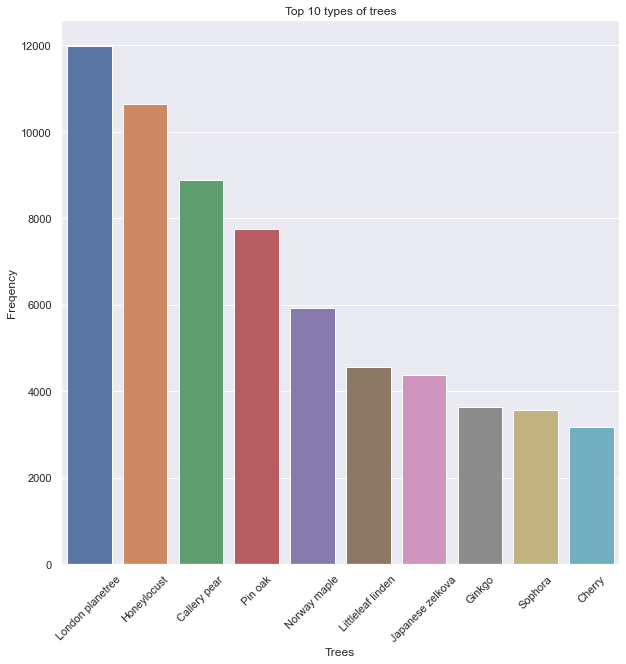
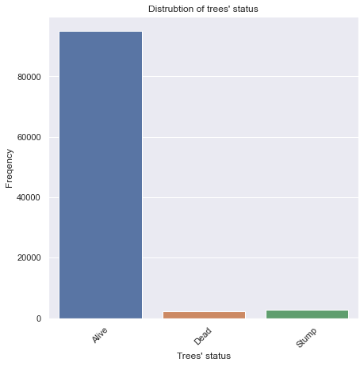
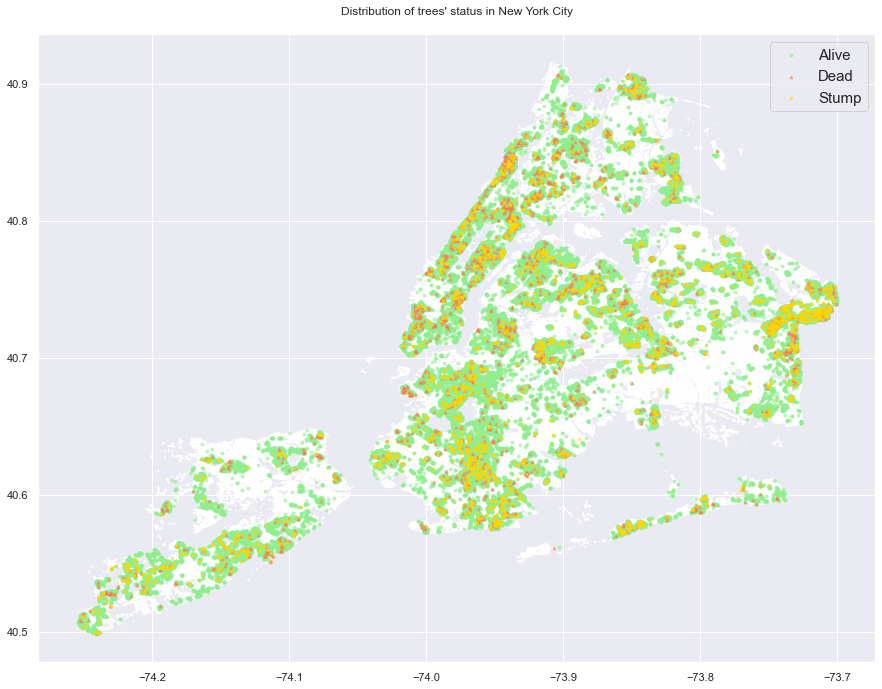

# Data cleaning project - NYC Trees

#### Final clean csv file: nyc_trees_clean

## Mission objectives

Clean properly a dataset for machine learning process.

## Tools used

- Pandas
- Matplotlib and Seaborn for data visualization
- Geopandas for map visualization

## Database

For this data cleaning project, we are working with a sample of the database ['2015 Street Tree Census - Tree Data'](https://data.cityofnewyork.us/Environment/2015-Street-Tree-Census-Tree-Data/uvpi-gqnh) provided by the Department of Parks and Recreation (DPR). The original database has information about 684k trees. In our sample, we have 100k trees (14,62%).

We find 42 columns, containing information such as the type of tree or its zip code. All are not useful for machine learning, so we'll do some cleaning and only keep the relevant ones. Some information is also redundant, so we'll get rid of them.

## Data visualization
After having some knowledge of the data using df.info() and df.head(), we'll create some plots to give us a clearer understanding. As the data is heavily location-oriented, I have also created a map of NYC with interesting information.

#### Top 10 types of trees in NYC

#### Distribution of trees in NYC, based on their status ('Alive', 'Dead' or 'Stump')
 

## Cleaning
### NaN-values
We have 4992 rows with some missing values for the columns 'health', 'spc_latin', 'spc_common', 'steward', 'guards', 'problems' and 'sidewalk'. We might be tempted to delete those rows with NaN values but those rows belong to either a 'stump' or 'dead' tree. Thus, it makes sense that they don't have any values for those columns. We should keep them.
Apart from that, only 1 row has the 'health' variable missing.

### Information not directly related to the tree characteristics which we'll not keep:
- 'created_at'
- 'tree_id'
- 'block_id'
- 'spc_latin'
- 'user_type'
- 'problems'

### Redudant location information about the trees, which we'll not keep:
- 'the_geom'
- 'state'
- 'zip_city'
- 'x_sp'
- 'y_sp'
- 'address'
- 'boroname'
- 'boro_ct'
- 'cb_num'
- 'st_assem'
- 'st_senate'
- 'nta_name'
- 'cncldist'

### Let's change the name of some columns so it's clearer to understand what information they contain:
- 'brnch_othe' -> 'branch_other'
- 'brnch_shoe' -> 'branch_shoe'
- 'brnch_ligh' -> 'branch_light'
- 'trnk_wire' -> 'trunk_wire'
- 'trnk_light' -> 'trunk_light'
- 'trnk_other' -> 'trunk_other'

### Let's make the name of the trees ('spc_common') similarly written: capitalized and replace "-" by " ".

### Change sidewalk(damage) to 'Yes' or 'No'
